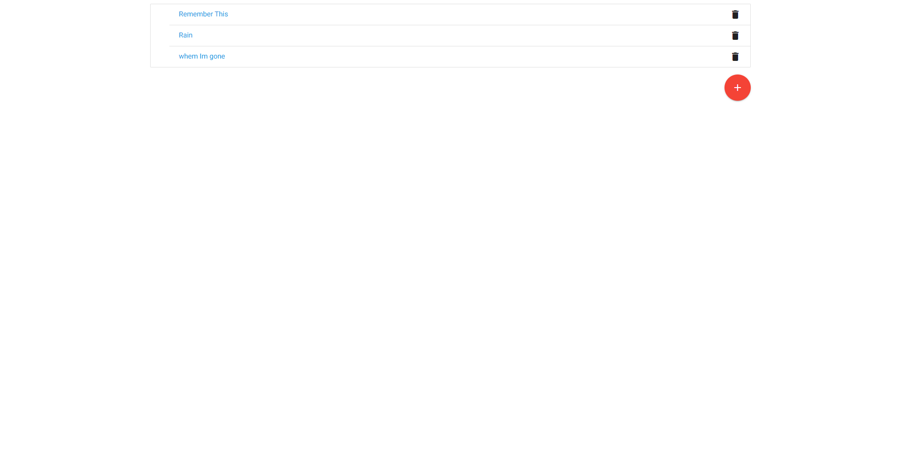

# Lyrical-GraphQL

## Description: Using GrapgQl you can add songs and lyrics to those songs

## How it is organaize:
### You click on number one to start

## How to run the app:
### 1. Git clone this repo
### 2. open index.html in your browser

### This app is not deploy but you can see my other projects in my portfolio
### http://armjimportfolio.herokuapp.com/

## Home page
